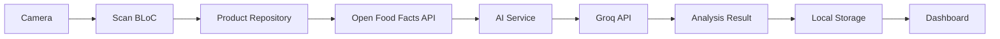

# 🌿 EcoScan AI - Tiêu Dùng Có Trách Nhiệm

> *Ứng dụng phân tích sản phẩm thông minh hỗ trợ người tiêu dùng Việt Nam đưa ra quyết định mua sắm bền vững và có trách nhiệm*

[](https://flutter.dev/)
[](https://dart.dev/)
[](LICENSE)

---

## 📋 Mục Lục

- [🌍 Bối Cảnh & Vấn Đề](#-bối-cảnh--vấn-đề)
- [🎯 Mục Tiêu & Giải Pháp](#-mục-tiêu--giải-pháp)
- [👥 Đối Tượng Người Dùng](#-đối-tượng-người-dùng)
- [📖 User Story Cụ Thể](#-user-story-cụ-thể)
- [🗺️ Hành Trình Người Dùng](#️-hành-trình-người-dùng)
- [✨ Tính Năng Chính](#-tính-năng-chính)
- [🏗️ Kiến Trúc Hệ Thống](#️-kiến-trúc-hệ-thống)
- [🚀 Cài Đặt & Chạy](#-cài-đặt--chạy)

---

## 🌍 Bối Cảnh & Vấn Đề

### 🔍 Bối Cảnh Thị Trường

Trong bối cảnh biến đổi khí hậu và ô nhiễm môi trường ngày càng nghiêm trọng, **tiêu dùng có trách nhiệm** đã trở thành xu hướng toàn cầu. Tại Việt Nam, thế hệ millennials và Gen Z ngày càng quan tâm đến tác động môi trường và sức khỏe của các sản phẩm họ sử dụng hàng ngày.

### ⚠️ Vấn Đề Hiện Tại

**1. Thiếu Thông Tin Minh Bạch**
- Người tiêu dùng khó hiểu được thành phần phức tạp trên nhãn sản phẩm
- Các thuật ngữ hóa học khó hiểu, không có giải thích bằng tiếng Việt
- Thiếu đánh giá độc lập về tác động môi trường và sức khỏe

**2. Greenwashing Lan Tràn**
- Nhiều sản phẩm tuyên bố "xanh", "tự nhiên" nhưng thành phần thực tế không tương ứng
- Marketing gây hiểu lầm khiến người tiêu dùng đưa ra quyết định sai lầm
- Thiếu công cụ để xác minh tính chính xác của các tuyên bố marketing

**3. Khó Khăn Trong Lựa Chọn**
- Quá nhiều sản phẩm trên thị trường, khó so sánh
- Không có hệ thống đánh giá thống nhất và đáng tin cậy
- Thiếu gợi ý sản phẩm thay thế tốt hơn

**4. Nhu Cầu Cá Nhân Hóa**
- Mỗi người có nhu cầu khác nhau (dị ứng, chế độ ăn, lối sống)
- Thiếu cảnh báo cá nhân hóa phù hợp với từng cá nhân
- Không có công cụ theo dõi thói quen tiêu dùng cá nhân

---

## 🎯 Mục Tiêu & Giải Pháp

### 🌟 Tầm Nhìn

Trở thành ứng dụng hàng đầu tại Việt Nam hỗ trợ người tiêu dùng đưa ra quyết định mua sắm thông minh, góp phần thực hiện **SDG 12 - Tiêu dùng và Sản xuất có trách nhiệm**.

### 🎯 Mục Tiêu Cụ Thể

1. **Minh Bạch Hóa Thông Tin**: Cung cấp phân tích chi tiết, dễ hiểu về từng thành phần sản phẩm
2. **Chống Greenwashing**: Phát hiện và cảnh báo các tuyên bố marketing không chính xác
3. **Cá Nhân Hóa**: Đưa ra cảnh báo và gợi ý phù hợp với nhu cầu riêng của từng người
4. **Giáo Dục**: Nâng cao nhận thức về tiêu dùng bền vững thông qua AI

### 💡 Giải Pháp Công Nghệ

**EcoScan AI** sử dụng công nghệ AI tiên tiến để:
- **Quét & Phân Tích**: Camera + AI nhận dạng mã vạch và OCR nhãn sản phẩm
- **Phân Tích Đa Chiều**: AI đánh giá sản phẩm theo 3 tiêu chí: Sức khỏe, Môi trường, Đạo đức
- **Cá Nhân Hóa**: Hệ thống hồ sơ cá nhân với cảnh báo dị ứng và lối sống
- **Theo Dõi Tác Động**: Dashboard cá nhân theo dõi thói quen tiêu dùng theo thời gian

---

## 👥 Đối Tượng Người Dùng

### 🎯 Người Dùng Chính

**1. Millennials & Gen Z Có Ý Thức Môi Trường (25-40 tuổi)**
- Thu nhập trung bình khá trở lên
- Quan tâm đến sức khỏe và môi trường
- Thường xuyên mua sắm online và offline
- Sẵn sàng trả thêm tiền cho sản phẩm bền vững

**2. Phụ Huynh Trẻ (28-45 tuổi)**
- Có con nhỏ, quan tâm đến an toàn thực phẩm
- Cần thông tin chi tiết về thành phần sản phẩm
- Muốn tránh các chất có hại cho trẻ em
- Thường mua sắm tại siêu thị và cửa hàng tiện lợi

**3. Người Có Nhu Cầu Đặc Biệt**
- Người bị dị ứng thực phẩm hoặc hóa chất
- Người ăn chay, thuần chay
- Người theo chế độ ăn đặc biệt (keto, paleo, không gluten)
- Cần cảnh báo cá nhân hóa khi mua sắm

### 👤 Persona Đại Diện

**Minh Anh - 32 tuổi, Marketing Manager, TP.HCM**
- Mẹ của bé 3 tuổi, quan tâm đến sức khỏe gia đình
- Thường mua sắm tại Co.opmart, Lotte Mart
- Bị dị ứng với paraben, muốn tránh hóa chất có hại
- Sử dụng smartphone thành thạo, thích các app tiện ích

---

## 📖 User Story Cụ Thể

### 🎬 Tình Huống

**Minh Anh đang đứng trong siêu thị, cầm trên tay chai sữa tắm cho bé. Cô ấy muốn chắc chắn sản phẩm này an toàn cho da nhạy cảm của con và không chứa các chất hóa học có hại.**

### 🎯 Mục Tiêu

- **Ngay lập tức**: Biết sản phẩm có an toàn cho bé không
- **Trung hạn**: Tìm được sản phẩm thay thế tốt hơn nếu cần
- **Dài hạn**: Xây dựng thói quen mua sắm có trách nhiệm cho gia đình

### 😰 Khó Khăn & Pain Points

1. **Thông Tin Phức Tạp**: Nhãn sản phẩm có nhiều thuật ngữ hóa học khó hiểu
2. **Thiếu Thời Gian**: Không thể nghiên cứu từng thành phần khi đang mua sắm
3. **Không Tin Tuyên Bố**: Nghi ngờ các tuyên bố "không chứa hóa chất", "an toàn cho trẻ em"
4. **Khó So Sánh**: Có nhiều sản phẩm tương tự, không biết chọn cái nào
5. **Lo Lắng Dị Ứng**: Sợ mua phải sản phẩm chứa paraben gây dị ứng

### ✅ Kết Quả Mong Muốn

- Có thông tin đánh giá độc lập, đáng tin cậy về sản phẩm
- Nhận cảnh báo rõ ràng nếu sản phẩm không phù hợp
- Được gợi ý sản phẩm thay thế tốt hơn
- Hiểu được tác động dài hạn của lựa chọn tiêu dùng

---

## 🗺️ Hành Trình Người Dùng

### 📱 Bước 1: Khám Phá & Cài Đặt (Discovery)

```
🔍 Tìm hiểu → 📱 Tải app → 👋 Onboarding → ⚙️ Thiết lập hồ sơ
```

**Minh Anh nghe bạn bè giới thiệu về EcoScan AI**
- Tải app từ App Store/Google Play
- Xem 3 màn hình giới thiệu tính năng
- Thiết lập hồ sơ: khai báo dị ứng paraben, có con nhỏ

### 📱 Bước 2: Sử Dụng Lần Đầu (First Use)

```
🏠 Mở app → 📷 Quét sản phẩm → ⏳ Chờ phân tích → 📊 Xem kết quả
```

**Tại siêu thị, Minh Anh quét chai sữa tắm**
- Mở app, nhấn nút "Quét ngay"
- Hướng camera vào mã vạch sản phẩm
- Chờ 3-5 giây AI phân tích
- **Kết quả**: 🔴 Điểm kém (35/100) - Chứa paraben có thể gây dị ứng

### 📱 Bước 3: Nhận Cảnh Báo & Hành Động (Alert & Action)

```
⚠️ Cảnh báo dị ứng → 🔍 Xem chi tiết → 🔄 Tìm sản phẩm thay thế
```

**Minh Anh nhận cảnh báo cá nhân hóa**
- Banner đỏ: "⚠️ Sản phẩm chứa paraben - có thể gây dị ứng"
- Xem phân tích chi tiết: Sodium Lauryl Sulfate có thể gây khô da
- Nhấn "Xem sản phẩm thay thế" → 3 gợi ý sản phẩm organic

### 📱 Bước 4: So Sánh & Quyết Định (Compare & Decide)

```
📊 So sánh sản phẩm → ✅ Chọn sản phẩm tốt → 🛒 Mua hàng
```

**Minh Anh so sánh và chọn sản phẩm tốt hơn**
- So sánh 2 sản phẩm: điểm số, thành phần, giá cả
- Chọn sản phẩm organic: 🟢 Điểm tốt (78/100)
- Mua sản phẩm mới, cảm thấy yên tâm

### 📱 Bước 5: Theo Dõi & Cải Thiện (Track & Improve)

```
📈 Xem dashboard → 🏆 Nhận huy hiệu → 🔄 Tiếp tục cải thiện
```

**Sau 1 tháng sử dụng**
- Xem báo cáo tháng: 70% sản phẩm xanh, cải thiện từ 40%
- Nhận huy hiệu "Eco Warrior" - quét 50 sản phẩm
- Chia sẻ thành tích lên social media

---

## ✨ Tính Năng Chính

### 🔍 1. Quét & Phân Tích Thông Minh

- **Quét Mã Vạch**: Camera AI nhận dạng mã vạch trong 2 giây
- **OCR Nhãn Sản Phẩm**: Chụp ảnh nhãn thành phần khi không có mã vạch
- **Nhập Thủ Công**: Nhập mã vạch bằng tay khi cần thiết

### 🤖 2. Phân Tích AI Đa Chiều

- **Sức Khỏe**: Đánh giá độc tính, allergen, tác động sức khỏe
- **Môi Trường**: Phân tích khả năng phân hủy, microplastic, carbon footprint
- **Đạo Đức**: Kiểm tra cruelty-free, vegan, fair trade

### 🎯 3. Eco Score Trực Quan

- **🟢 Tốt (≥70 điểm)**: Sản phẩm an toàn, bền vững
- **🟡 Trung bình (40-69 điểm)**: Có một số vấn đề cần lưu ý
- **🔴 Kém (<40 điểm)**: Nhiều thành phần có hại, nên tránh

### 🛡️ 4. Phát Hiện Greenwashing

- **Phân Tích Tuyên Bố**: So sánh marketing claims với thành phần thực tế
- **Cảnh Báo Gian Lận**: Phát hiện các tuyên bố "xanh" không chính xác
- **Giải Thích Chi Tiết**: Lý do tại sao tuyên bố không đúng sự thật

### 👤 5. Cá Nhân Hóa Hoàn Toàn

- **Hồ Sơ Dị Ứng**: 9+ loại dị ứng chuẩn + tùy chỉnh
- **Lối Sống**: Vegetarian, Vegan, Eco-conscious, Cruelty-free
- **Chế độ Ăn**: Keto, Paleo, Gluten-free, Low-sugar, v.v.
- **Cảnh Báo Thông Minh**: Cảnh báo ngay khi phát hiện xung đột

### 🔄 6. Gợi Ý Sản Phẩm Thay Thế

- **Tìm Kiếm Thông Minh**: Gợi ý từ cơ sở dữ liệu 2M+ sản phẩm
- **So Sánh Chi Tiết**: Bảng so sánh side-by-side
- **Lọc Theo Hồ Sơ**: Chỉ gợi ý sản phẩm phù hợp với người dùng

### 📊 7. Dashboard Tác Động Cá Nhân

- **Thống Kê Thời Gian Thực**: Biểu đồ tuần/tháng/năm
- **Xu Hướng Cải Thiện**: Theo dõi tiến bộ tiêu dùng xanh
- **Huy Hiệu Thành Tích**: Gamification khuyến khích hành vi tích cực

### 🌐 8. Đa Ngôn Ngữ & Offline

- **Tiếng Việt/Anh**: Giao diện và phân tích AI
- **Hoạt Động Offline**: Xem lịch sử và hồ sơ không cần mạng
- **Đồng Bộ Đám Mây**: Backup dữ liệu qua Google Sign-in

---

## 🏗️ Kiến Trúc Hệ Thống

### 🔧 Tech Stack

- **Frontend**: Flutter 3.24+ (Cross-platform iOS/Android)
- **State Management**: BLoC Pattern (flutter_bloc)
- **Local Storage**: Hive + SharedPreferences
- **AI Analysis**: Groq API (Llama 3.3 70B)
- **Product Database**: Open Food Facts API
- **OCR**: Google ML Kit
- **Authentication**: Google Sign-In

### 🏛️ Architecture Pattern

```
┌─────────────────┐    ┌─────────────────┐    ┌─────────────────┐
│   Presentation  │    │     Domain      │    │      Data       │
│                 │    │                 │    │                 │
│ • Screens (100) │◄──►│ • Entities      │◄──►│ • Repositories  │
│ • Widgets       │    │ • Use Cases     │    │ • Services      │
│ • BLoCs         │    │                 │    │ • Models        │
└─────────────────┘    └─────────────────┘    └─────────────────┘
```

### 🔄 Data Flow



### 🗄️ Data Models

**Core Models:**
- `ProductModel`: Thông tin sản phẩm từ Open Food Facts
- `AIAnalysisModel`: Kết quả phân tích AI đa chiều
- `UserProfile`: Hồ sơ cá nhân (dị ứng, lối sống, chế độ ăn)
- `ScanRecord`: Lịch sử quét sản phẩm
- `IngredientAnalysis`: Phân tích từng thành phần

---

## 🚀 Cài Đặt & Chạy

### 📋 Yêu Cầu Hệ Thống

- **Flutter SDK**: 3.24.0 trở lên
- **Dart SDK**: 3.5.0 trở lên
- **Android**: API level 21+ (Android 5.0+)
- **iOS**: iOS 12.0+
- **RAM**: Tối thiểu 4GB (khuyến nghị 8GB)

### ⚙️ Cài Đặt

1. **Clone Repository**
```bash
git clone https://github.com/your-org/ecoscan-ai.git
cd ecoscan-ai
```

2. **Cài Đặt Dependencies**
```bash
flutter pub get
```

3. **Cấu Hình Environment**
```bash
# Tạo file .env
cp .env.example .env

# Thêm API keys (optional - app có built-in keys)
GROQ_API_KEY=your_groq_api_key_here
```

4. **Chạy Code Generation**
```bash
flutter packages pub run build_runner build
```

5. **Chạy Ứng Dụng**
```bash
# Debug mode
flutter run

# Release mode
flutter run --release
```

### 🔑 API Keys (Tùy Chọn)

App đã tích hợp sẵn API keys để test. Để sử dụng keys riêng:

- **Groq API**: [console.groq.com](https://console.groq.com) (Free tier: 14,400 requests/day)
- **Open Food Facts**: Không cần API key (public API)
- **Google ML Kit**: Không cần API key (on-device processing)

### 📱 Build Production

```bash
# Android APK
flutter build apk --release

# Android App Bundle
flutter build appbundle --release

# iOS
flutter build ios --release
```

---

## 📊 Metrics & KPIs

### 🎯 Business Metrics

- **User Adoption**: 10,000+ downloads trong 3 tháng đầu
- **Engagement**: 70%+ người dùng quét ≥5 sản phẩm/tháng
- **Retention**: 60%+ người dùng active sau 30 ngày
- **Impact**: 50%+ người dùng cải thiện eco score cá nhân

### 📈 Technical Metrics

- **Performance**: App khởi động <3 giây
- **Accuracy**: AI analysis accuracy >85%
- **Reliability**: 99.5% uptime cho API calls
- **User Experience**: 4.5+ rating trên app stores

---

## 🤝 Đóng Góp

Chúng tôi hoan nghênh mọi đóng góp từ cộng đồng! Xem [CONTRIBUTING.md](CONTRIBUTING.md) để biết chi tiết.

### 🐛 Báo Lỗi

Tạo issue mới tại [GitHub Issues](https://github.com/your-org/ecoscan-ai/issues)

### 💡 Đề Xuất Tính Năng

Chia sẻ ý tưởng tại [GitHub Discussions](https://github.com/your-org/ecoscan-ai/discussions)

---

## 📄 License

Dự án này được phát hành dưới [MIT License](LICENSE).

---

## 🙏 Acknowledgments

- **Open Food Facts**: Cơ sở dữ liệu sản phẩm mở
- **Groq**: AI inference platform
- **Google ML Kit**: OCR technology
- **Flutter Community**: Framework và packages

---

## 📞 Liên Hệ

- **Email**: ecoscan.ai@gmail.com
- **Website**: [ecoscan-ai.com](https://ecoscan-ai.com)
- **GitHub**: [github.com/your-org/ecoscan-ai](https://github.com/your-org/ecoscan-ai)

---

*Được phát triển với 💚 cho một tương lai bền vững*
